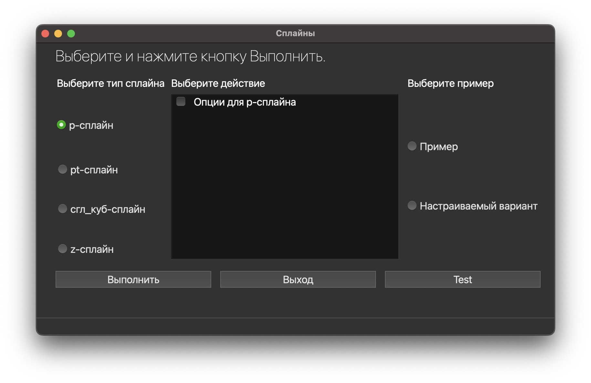
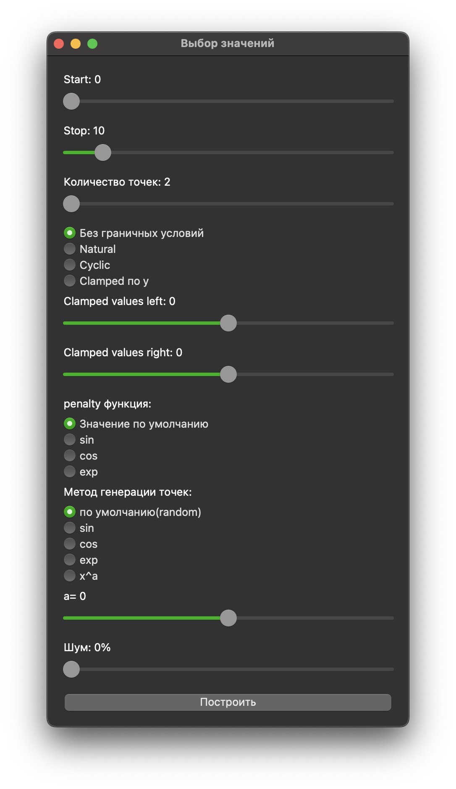
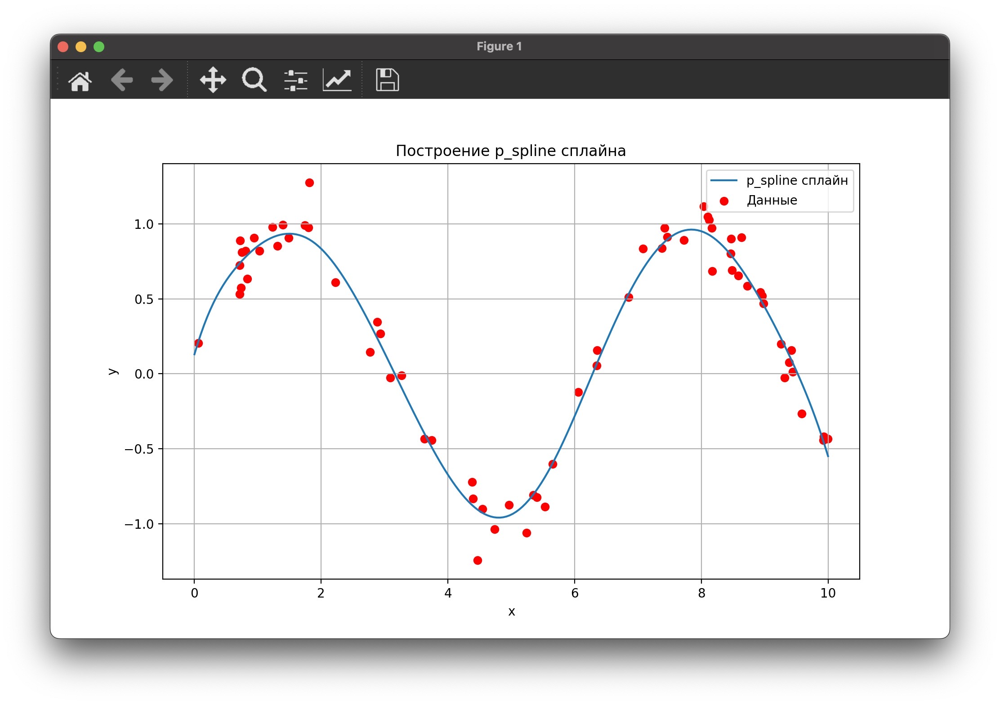
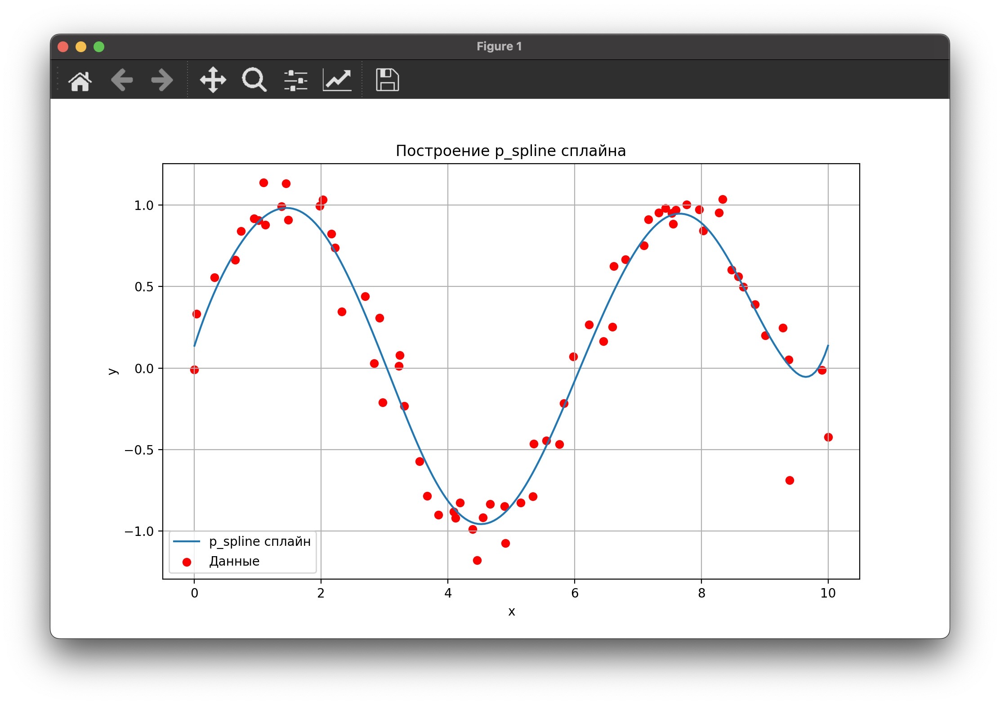
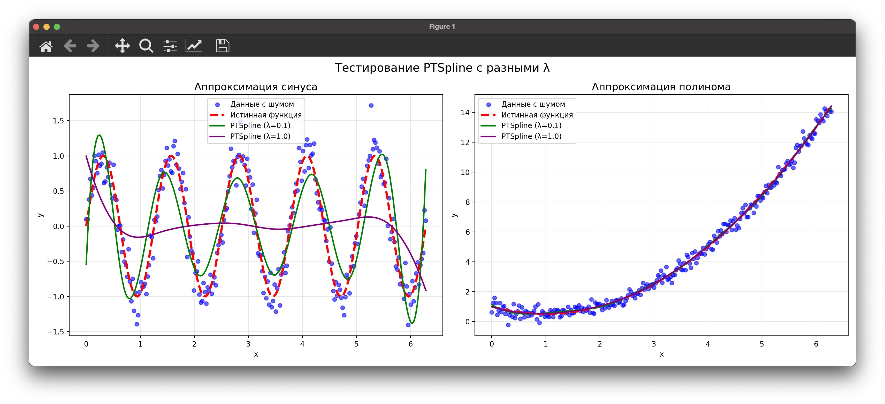
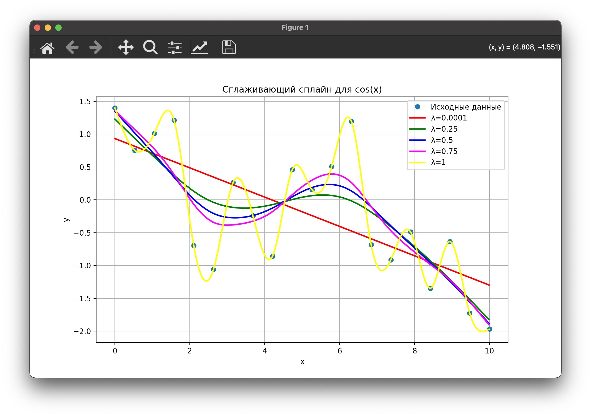
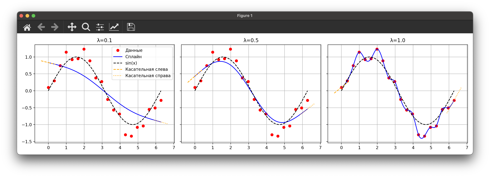
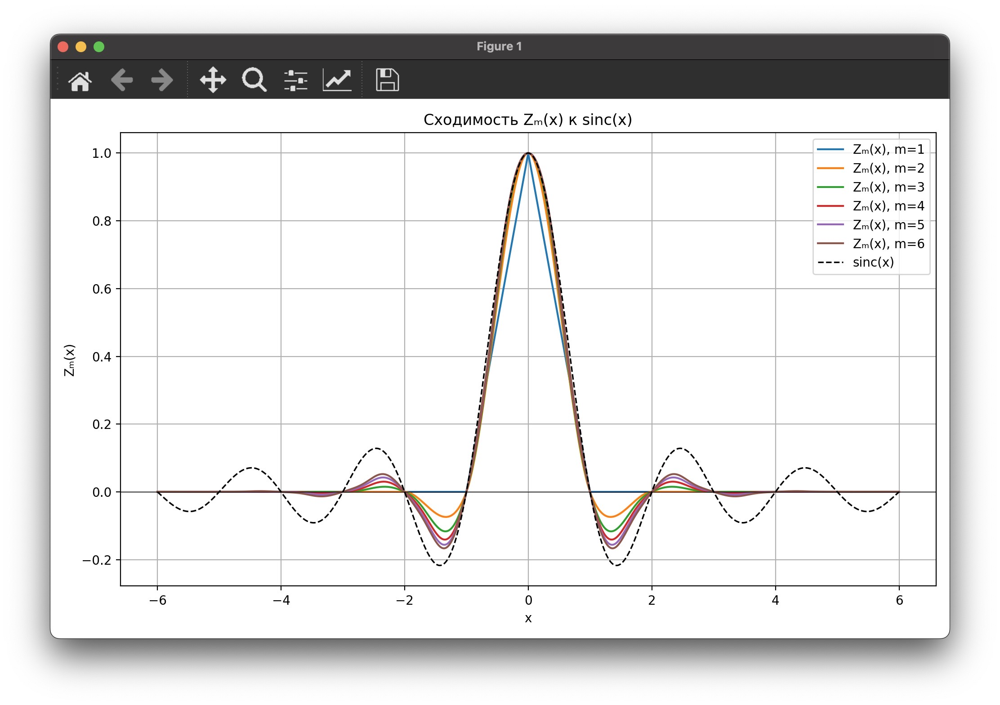

###  Использование:

1. Установите зависимости:

   ```bash
   pip install -r requirements.txt
   ```

2. Запустите скрипт:

   ```bash
   python main.py
   ```

В проекте используется версия Python 3.12.3. Если возникают ошибки по поводу библиотек, это может быть связано с использованием конфигурации Python из другого проекта. Решение: активировать виртуальное окружение текущего проекта или установить зависимости в нужной среде.

### Структура проекта:

1. **main.py**: Главный файл запуска. Связывает интерфейс (GUI) и библиотеки для построения сплайнов.

   - Путь: `/splines/main.py`

2. **splines.py**: Реализация базового класса Spline и его наследников(PTSpline, p_spline, b_spline, SmoothingCubicSpline, CardinalZSpline).

   - Путь: `/splines/code_interfaces/splines.py`

3. **interface.py**: Логика взаимодействия интерфейса с функциями сплайнов. Подключает GUI к библиотеке сплайнов.

   - Путь: `/splines/code_interfaces/interface.py`

4. **help_func.py**: Вспомогательные функции(генерация узлов)

   - Путь: `/splines/code_interfaces/help_func.py`

5. **Файлы интерфейса (.ui)**:

   - Путь: `/splines/code_interfaces/ui/`
   
   - `main.ui`: Главный интерфейс с настройками и выбором сплайнов.
   - `b_variable.ui`, `p_variable.ui`: Настройки для различных типов сплайнов.

6. **README.md**: Лицевая страница проекта, краткое описание, цели и контакты руководителя/участников .

   - Путь: `/splines/README.md`

7. **START.md**: Этот файл содержит инструкции по работе с проектом и его запуску.

   - Путь: `/splines/START.md`

### Запуск проекта:

#### 1. Режим GUI:

Для построения графиков с помощью интерфейса:

```bash
python main.py
```

Выберите нужный тип сплайна, настройте параметры и нажмите "Построить" для отображения результата.



Пример настраиваемого варианта P-сплайна


#### 2. Использование без GUI:

Описание функции для построения P-сплайна(с указанными по умолчанию параметрами):

```python
 def plot_p_spline(
        start=0, 
        stop=10, 
        num=100, 
        boundary_conditions=None, 
        clamped_values=None,
        penalty_fun=None, 
        point_gen_func="random", 
        power_exp=2, 
        noise_variance=0.0
 ):
   #код функции
```
### Параметры функции plot_p_spline:

- `start` (float): Начало диапазона x.(график от - до)
- `stop` (float): Конец диапазона x.
- `num` (int): Количество точек.
- `boundary_conditions` (str): Тип граничных условий (`'natural'`, `'clamped'`, `cyclic`).
- `clamped_values` (dict): Значения производных для `'clamped'` условий.
   Задаются таким образом:
```python
clamped_values = {'left': 1,'right': 1}
```
- `penalty_fun` (callable): Штрафная функция, в параметр передается функтор, например sin.
- `point_gen_func` (str): Метод генерации точек (`'random'`, `'sin'`, `'cos'`, `'exp'`, `'power'`).
- `power_exp` (float): Степень для метода `'power'`(x^a).
- `noise_variance` (float): Дисперсия шума (по умолчанию 0.0).

### Пример вызова:

```python
from code_interfaces.splines import p_spline

# Построение P-сплайна с параметрами по умолчанию

p_spline.plot_p_spline()

# Построение P-сплайна с использованием различных методов генерации данных
p_spline.plot_p_spline(
    start=0,
    stop=10,
    num=100,
    boundary_conditions='natural',
    clamped_values=None,
    penalty_fun=None,
    point_gen_func='random',
    power_exp=2,
    noise_variance=0.1
)
```

Описание функции для построения z-кардинального сплайна(с указанными по умолчанию параметрами):

```python
def plot(m, func=None,
          num_points=1000, figsize=(10, 6),
          title=None, show_original=True,
          grid=True, legend=True):
     """
     Визуализация кардинального Z-сплайна порядка m.

     Параметры:
     - m: порядок сплайна (int)
     - func: функция f(x), которую интерполирует Z-сплайн (если None — импульс)
     - num_points: точек для построения
     - figsize: размер графика
     - title: заголовок
     - show_original: рисовать ли исходную функцию
     - grid, legend: отображать ли сетку и легенду
     """
```

Описание функции для построения pt-сплайна(с указанными по умолчанию параметрами):

```python
def plot(x, y, degree=3, smoothing_param=1.0, knots=None,
          show_data=True, color='blue', title=None,
          num_points=300, figsize=(10, 6), grid=True, legend=True):
     """
     Визуализация Penalized Truncated Spline по заданным параметрам.

     Параметры:
     - x, y: данные
     - degree: степень полинома
     - smoothing_param: параметр сглаживания λ
     - knots: массив внутренних узлов или None
     - show_data: отображать ли точки
     - color: цвет линии сплайна
     - title: заголовок графика
     - num_points: число точек на графике
     - figsize: размер фигуры
     - grid, legend: отображение сетки и легенды
     """
```

Описание функции для построения сглаживающего кубического сплайна(с указанными по умолчанию параметрами):

```python
def plot(x, y, lam=0.5,
          show_data=True, color='blue', title=None,
          num_points=300, figsize=(10, 6), grid=True, legend=True):
     """
     Визуализация CubicClosedSpline по заданным параметрам.

     Параметры:
     - x, y: входные данные
     - lam: параметр сглаживания λ
     - show_data: показывать ли точки
     - color: цвет линии сплайна
     - title: заголовок
     - num_points: число точек на графике
     - figsize: размер фигуры
     - grid, legend: отображение сетки и легенды
     """
```

Для демонстрации реализованы статические методы сплайн.demo()

1. **P-сплайн**:

P-сплайн с циклическими граничными условиями

2. **PT-сплайн**:

3. **Сглаживающий кубический сплайн**:

4. **Сглаживающий кубический сплайн с закрепленными концами**:

5. **Z-кардинальный сплайн**:


Чтобы вызвать/реализовать сплайн вручную достаточно создать 
объект класса необходимого сплайна и передать ему требуемые параметры

### Пример:
```python
import numpy as np
import matplotlib.pyplot as plt
from code_interfaces.splines import PSpline
np.random.seed(42)
x = np.linspace(0, 10, 100)
y_true = 0.5 * x + np.sin(x)
y = y_true + np.random.normal(scale=0.5, size=x.shape)

pspline = PSpline(degree=3, penalty_order=2, lambda_=1.0)
pspline.fit(x, y)

x_range = (min(x), max(x))
x_vals = np.linspace(x_range[0], x_range[1], 200)
y_vals = pspline.predict(x_vals)

plt.figure(figsize=(10, 6))
plt.plot(x_vals, y_vals, label=f"{pspline.__class__.__name__} сплайн")
plt.scatter(x, y, color='red', s=20, alpha=0.7, label="Данные")
plt.xlabel("x")
plt.ylabel("y")
plt.title(f"Построение {pspline.__class__.__name__} сплайна")
plt.legend()
plt.grid(True)
plt.show()
```

Чтобы добавить свой сплайн, нужно написать класс сплайна, как наследника абстрактного класса, в splines.py.