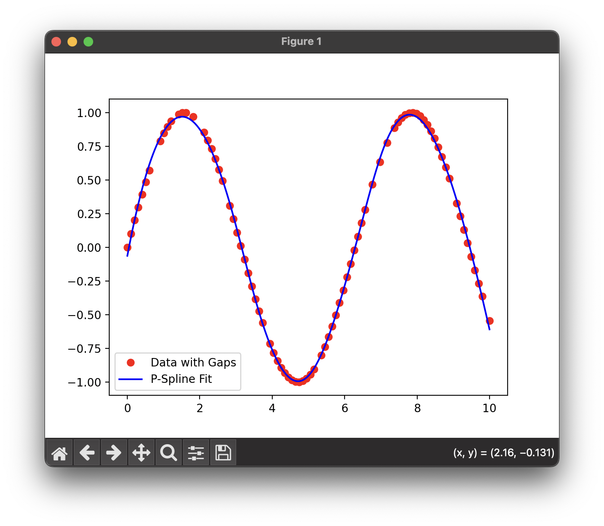
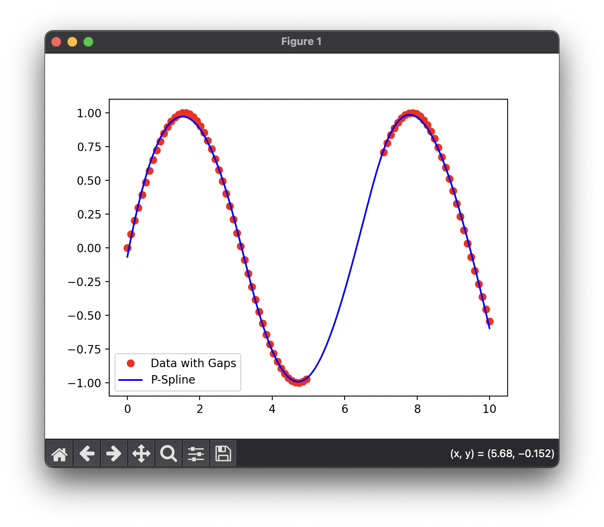
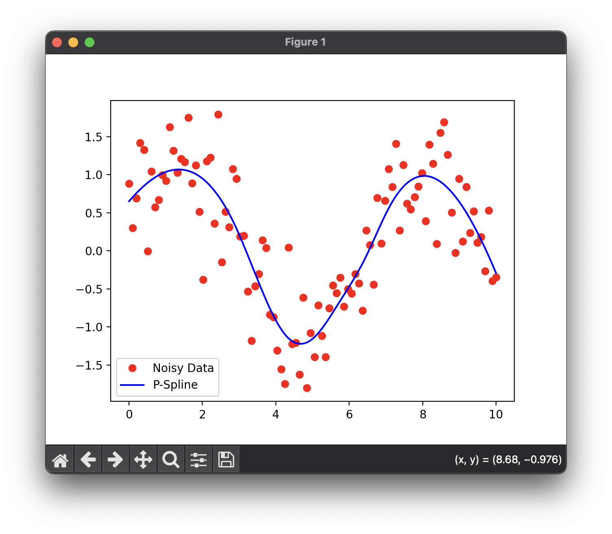
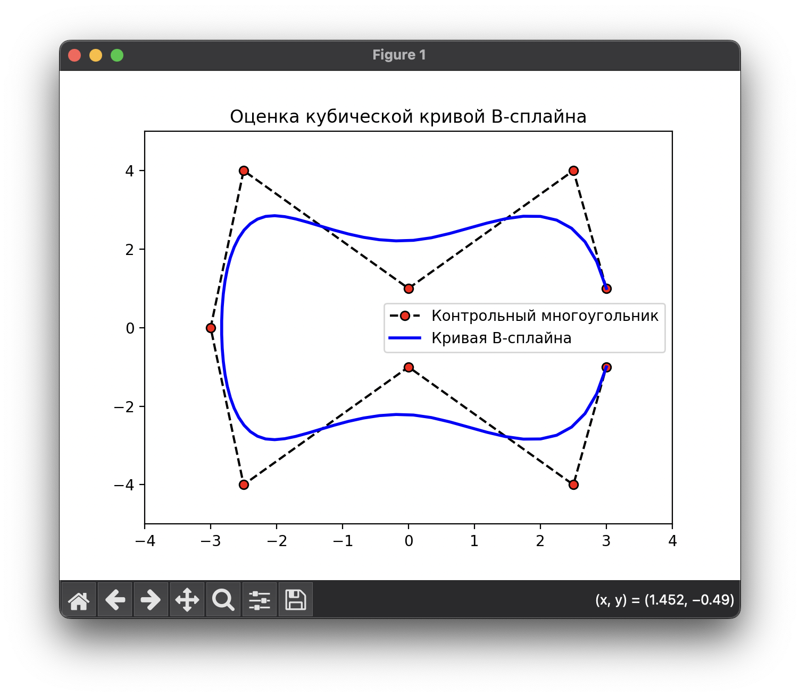
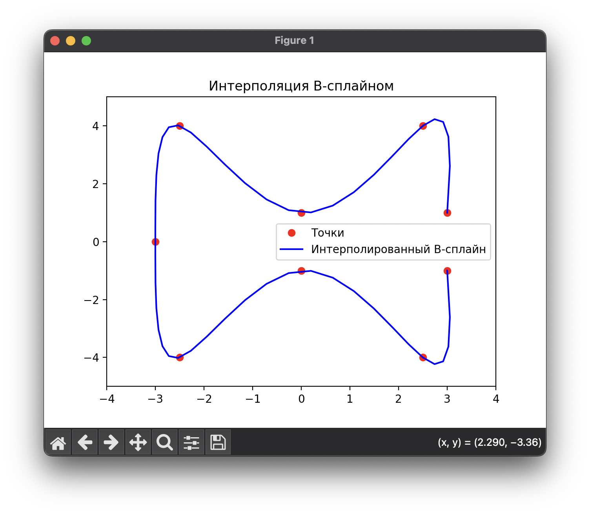

# Исходники P-сплайнов и B-сплайнов

В этом репозитории представлены несколько скриптов, демонстрирующих использование P-сплайнов и B-сплайнов для интерполяции данных, с пропусками, с шумом и ссылку на репозиторий библиотеки для работы со сплайнами.

## 1. Интерполяция данных с пропусками ([p_spline_gapped_data_interpolation.py](p_spline_gapped_data_interpolation.py))
Этот скрипт выполняет интерполяцию данных с пропусками с использованием P-сплайнов. Данные содержат синусоидальный сигнал, из которого удалены случайные 20%. Цель скрипта — восстановить эти данные.

### График:

---

## 2. Интерполяция с использованием P-сплайнов и пропусками ([p_spline_interpolation_with_gaps.py](p_spline_interpolation_with_gaps.py))
Скрипт реализует интерполяцию P-сплайнами для данных с пропусками. Пример демонстрирует восстановление синусоидального сигнала, у которого случайно удалены некоторые точки.

### График:

---

## 3. Интерполяция шумных данных с P-сплайнами ([p_spline_noisy_data.py](p_spline_noisy_data.py))
Скрипт выполняет интерполяцию данных с шумом, используя P-сплайны для сглаживания. Данные представляют собой синусоидальный сигнал с добавленным шумом.

### График:

---

## 4. Оценка B-сплайна ([spline_evaluation.py](spline_evaluation.py))
Этот скрипт создает и визуализирует кубическую кривую B-сплайна с заданными контрольными точками. Он также рисует контрольный многоугольник и B-сплайн.

### График:

---

## 5. Интерполяция с B-сплайнами ([spline_interpolation.py](spline_interpolation.py))
Этот скрипт выполняет интерполяцию с использованием B-сплайнов для заранее определенных контрольных точек. Визуализируется как сама кривая сплайна, так и контрольные точки.

### График:

---

# 6. SplineLibrary

[Оригинальный репозиторий](https://github.com/ejmahler/SplineLibrary/tree/master)

**SplineLibrary** — это C++11 библиотека для работы со сплайнами, которая включает:

- Интерполяцию различных типов сплайнов, включая Каталонские сплайны.
- Зацикленные (периодические) сплайны.
- Вычисление длины дуги сплайна.
- Обратное вычисление сплайна для нахождения ближайшей точки к заданной.
- Вычисление первой, второй и третьей производных сплайна (касательная, кривизна, "изгиб").
